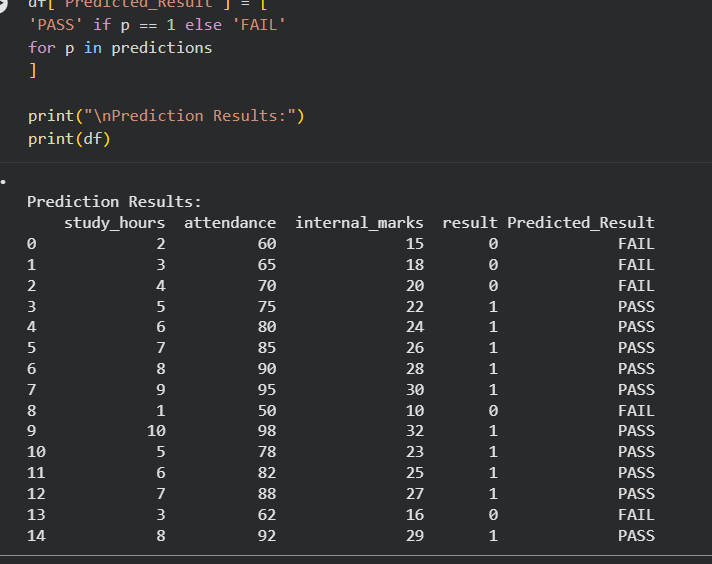

# Student Result Prediction System

This project predicts whether a student will PASS or FAIL using Logistic Regression.

## Technologies Used
- Python
- Pandas
- Scikit-Learn
- Google Colab

## Features
- Reads student data from CSV
- Trains Logistic Regression model
- Predicts PASS/FAIL
- Saves prediction results

## Dataset Columns
- study_hours
- attendance
- internal_marks
- result
## Model Accuracy

Accuracy achieved by Logistic Regression: 100%(Accuracy.png)

## Prediction Results

